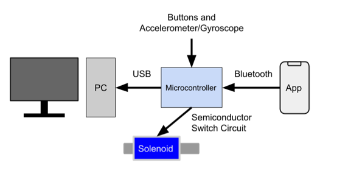
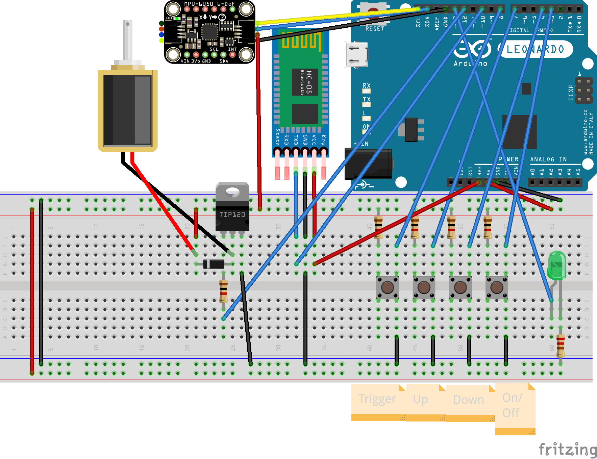

# Guntroller

By Bennett Cuba, Jiacheng Hou, Eric Ko, and Quinn Leader

CS179J - Senior Design Project in Computer Architecture and Embedded Systems

*University of California, Riverside*

---

## Project Description

The Guntroller is a device that one can use as a controller with a desktop computer in a household. It uses accelerometer/gyroscope on an Arduino to aim and turn, a solenoid to simulate recoil, and an Android smartphone as a pedometer to move.

## Project Requirements

[Project Requirement Specification](https://docs.google.com/document/d/1ixeDe6Jb7c0Ek7XUqX1nqLU4_VB7hxSOK8AWoJY3O18/edit?usp=sharing)

## Guntroller Components

### Gun Shaped Controller

### Android App

The Android app sends a signal to the Guntroller whenever it detects
walking movement. This signal is sent over a Bluetooth connection with
the Guntroller. To connect the app to the Guntroller press the Bluetooth
icon in the upper right corner of the app. The name of the Bluetooth module
is `HC-05` and the pin is `1234`. Once connected the app will send signals
as long as it remains open. When first using the app Android may ask for the
permissions listed below. In order for the app to work all permissions must
be granted and the reasons as to why are included in the following table.

#### Permissions

| Permission | Reason |
| ---------- | ------ |
| Activity Recognition | Needed to check whether the user is walking |
| Bluetooth | Needed to connect to the Guntroller over Bluetooth |
| Coarse Location | This permission is needed to do Bluetooth scanning because a Bluetooth scan could reveal location data |

## Project Progress

[Gantt Chart](https://docs.google.com/spreadsheets/d/114Kd9no1A45DeJyBgwS2PYVXap5oLFPu3NEgJw_vOGg/edit?usp=sharing)

## Arduino Sketch

### Included Libraries

1. Mouse
2. Keyboard
3. SoftwareSerial
4. Adafruit_MPU6050
5. Adafruit_Sensor

### Milestones

#### Milestone I

- [ ] ~~Read accelerometer/gyroscope data~~ (Unable to finish due to parts not arriving)
- [x] Disassemble Nerf gun and preparing as housing for later use
- [x] Develop a basic pedometer app that sends signals on step events for Android.

[Presentation Slides](https://docs.google.com/presentation/d/11eOQ2mB0kn6n8374ptzPDPlSApvbqwHq25SQU0-j_kE/edit?usp=sharing)

#### Milestone II

- [x] Read accelerometer/gyroscope data (Moved from Milestone I)
- [x] Read accelerometer/gyroscope data
- [x] Process accelerometer/gyroscope data into appropriate inputs
- [x] Establish a Bluetooth connection between the pedometer app and microcontroller.

[Presentation Slides](https://docs.google.com/presentation/d/1K3dnDnPc4nWm6DN6nAo_M9VkBDGtcA2TtoL7Waqdnd4/edit?usp=sharing)

#### Milestone III (internal)

- [x] Pedometer app uses Bluetooth to send step signals to the microcontroller.
- [ ] Translate data inputs into game specific actions.

#### Final Demo

- [ ] Implement solenoid for recoil simulation.
- [ ] The controller's physical form resembles a gun.
- [ ] Final Presentation

## Testing

[Testing Strategy Document](https://docs.google.com/document/d/1sgLBqdYWkjyDIFjX3zhHuqd7Ft7VmxpZ4lNj_bPD-i8/edit?usp=sharing)

[Testing Log](https://docs.google.com/spreadsheets/d/1BwUKh9LCYZT5Kyqq0h0FdW5ELCY_bZ4H4P_4RCk5O5A/edit?usp=sharing)
