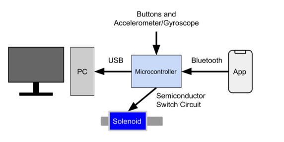

# Guntroller

By Bennett Cuba, Jiacheng Hou, Eric Ko, and Quinn Leader

CS179J - Senior Design Project in Computer Architecture and Embedded Systems

*University of California, Riverside*

---

## Project Description

The Guntroller is a device that one can use as a controller with a desktop computer in a household. It uses accelerometer/gyroscope on an Arduino to aim and and turn, a solenoid to shoot, and an Android smartphone as a pedometer to move.

## Project Requirements

[Project Requirement Specification](https://docs.google.com/document/d/1ixeDe6Jb7c0Ek7XUqX1nqLU4_VB7hxSOK8AWoJY3O18/edit?usp=sharing)

## Guntroller Components

### Gun Shapred Controller

### Android App

*Please add app docs here*

## Project Progress

[Gantt Chart](https://docs.google.com/spreadsheets/d/114Kd9no1A45DeJyBgwS2PYVXap5oLFPu3NEgJw_vOGg/edit?usp=sharing)

### Milestones

#### Milestone I

- [ ] ~~Read accelerometer/gyroscope data~~ (Unable to finish due to parts not arriving)
- [x] Disassemble nerf gun and preparing as housing for later use
- [x] Develop a basic pedometer app that sends signals on step events for Android.

[Presentation Slides](https://docs.google.com/presentation/d/11eOQ2mB0kn6n8374ptzPDPlSApvbqwHq25SQU0-j_kE/edit?usp=sharing)

#### Milestone II

- [ ] Read accelerometer/gyroscope data (Moved from Milestone I)
- [ ] Read accelerometer/gyroscope data
- [ ] Process accelerometer/gyroscope data into appropriate inputs
- [ ] Establish a bluetooth connection between the pedometer app and microcontroller.

#### Milestone III (internal)

- [ ] Pedometer app uses bluetooth to send step signals to the microcontroller.
- [ ] Translate data inputs into game specific actions.

#### Final Demo

- [ ] Implement solenoid for recoil simulation.
- [ ] The controller's physical form resembles a gun.
- [ ] Final Presentation

## Testing

[Testing Strategy Document](https://docs.google.com/document/d/1sgLBqdYWkjyDIFjX3zhHuqd7Ft7VmxpZ4lNj_bPD-i8/edit?usp=sharing)

[Testing Log](https://docs.google.com/spreadsheets/d/1BwUKh9LCYZT5Kyqq0h0FdW5ELCY_bZ4H4P_4RCk5O5A/edit?usp=sharing)

